# Best Practices for Generating Clean Mermaid Flowcharts via LLM Prompts

**Research Report | January 2026**

---

## Executive Summary

This research synthesizes best practices for generating clean, organized, human-readable Mermaid flowchart diagrams through LLM prompts. The key findings center on three pillars:

1. **Complexity Constraints**: Keep diagrams under 50 nodes for high-density graphs, under 100 connections total, and organize content into 5-9 logical chunks (Miller's Law)
2. **Structured Prompting**: Use few-shot examples, explicit format constraints, and system prompts that specify diagram type, node limits, and styling requirements
3. **Hierarchical Decomposition**: Break complex flows into multiple focused diagrams using progressive disclosure, with clear subgraph organization

**Bottom Line**: The most effective approach combines explicit complexity limits in prompts ("maximum 15 nodes"), few-shot examples showing desired output structure, and instructions to split complex topics into multiple linked diagrams.

---

## Table of Contents

1. [Cognitive Load and Diagram Limits](#1-cognitive-load-and-diagram-limits)
2. [Prompt Engineering Techniques](#2-prompt-engineering-techniques)
3. [Mermaid Syntax Best Practices](#3-mermaid-syntax-best-practices)
4. [Hierarchical Diagram Generation](#4-hierarchical-diagram-generation)
5. [Terminal-Friendly Alternatives](#5-terminal-friendly-alternatives)
6. [Recommended Prompt Templates](#6-recommended-prompt-templates)
7. [Before/After Examples](#7-beforeafter-examples)
8. [Common Errors and Fixes](#8-common-errors-and-fixes)

---

## 1. Cognitive Load and Diagram Limits

### Miller's Law: The 7 +/- 2 Constraint

George Miller's seminal 1956 research established that working memory holds approximately 7 (plus or minus 2) chunks of information. This has direct implications for diagram design:

| Guideline | Recommendation | Source |
|-----------|----------------|--------|
| Working memory items | 5-9 chunks maximum | Miller (1956) |
| High-density graphs | Under 50 nodes | PubMed research |
| Low-density graphs | Under 100 nodes | PubMed research |
| Connections ceiling | ~100 total connections | Mermaid.ai blog |

**Key Insight**: Mermaid's own documentation warns that "Flow charts are O(n)^2 complex, so don't go over 100 connections." This exponential complexity means adding just a few nodes dramatically increases visual confusion.

### Practical Node Limits for LLM Generation

Based on cognitive research and diagram readability studies:

| Diagram Type | Recommended Max Nodes | Max Connections |
|--------------|----------------------|-----------------|
| Simple flowchart | 10-15 | 15-20 |
| Process workflow | 15-25 | 25-40 |
| System architecture | 25-40 | 50-75 |
| Complex with subgraphs | 40-60 (split across subgraphs) | 75-100 |

**Critical Threshold**: When a single diagram exceeds 20 nodes, strongly consider decomposition into multiple diagrams.

---

## 2. Prompt Engineering Techniques

### 2.1 Few-Shot Prompting (Most Effective)

Few-shot prompting provides 2-3 examples of desired output format, demonstrating structure before requesting generation. Research shows diminishing returns after 2-3 examples.

**Why it works for diagrams**:
- Establishes exact syntax expectations
- Shows node naming conventions
- Demonstrates desired complexity level
- Provides structural templates

**Example Pattern**:
```
Here's an example of a well-structured flowchart:

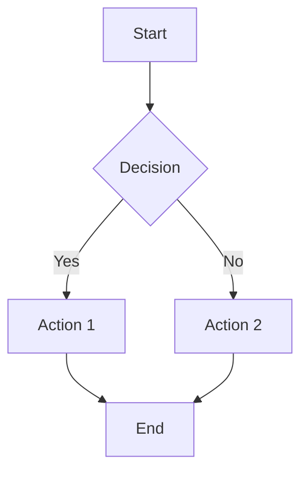

Now create a similar flowchart for [your topic], keeping the same level of simplicity (5-7 nodes maximum).
```

### 2.2 Chain-of-Thought for Complex Diagrams

For complex topics, instruct the LLM to think through the structure before generating code:

```
Before generating the Mermaid code:
1. List the 5-7 most important steps in this process
2. Identify the key decision points (maximum 2-3)
3. Group related steps into 2-3 logical phases
4. Then generate the diagram covering only these elements
```

This approach improves accuracy by ~300% for complex reasoning tasks and translates well to diagram generation.

### 2.3 Constraint Specification (Critical)

Explicitly state limits in prompts. LLMs without constraints will over-generate.

**Effective constraint patterns**:
- "Maximum 12 nodes"
- "No more than 3 decision points"
- "Use exactly 2 subgraphs"
- "Keep all labels under 5 words"
- "Only show the happy path, not error handling"

### 2.4 HyDE (Hypothetical Document Embedding)

Before generating, have the LLM write a brief prose description of what the diagram should show. This bridges vocabulary gaps and ensures alignment.

```
First, describe in 2-3 sentences what this diagram will show.
Then generate Mermaid code that visualizes exactly that description.
```

---

## 3. Mermaid Syntax Best Practices

### 3.1 Node Naming Conventions

| Pattern | Example | Use Case |
|---------|---------|----------|
| Short IDs + Labels | `A[User submits form]` | Recommended default |
| Semantic IDs | `submit[Submit Form]` | Self-documenting code |
| Numbered IDs | `step1[First step]` | Sequential processes |

**Best Practice**: Use short alphanumeric IDs (A, B, C or auth, db, api) with descriptive labels in brackets.

**Reserved Words to Avoid**:
- `end` - Capitalize as `End` or `END`
- Starting with `o` or `x` - These conflict with edge types

### 3.2 Edge Labels

Keep edge labels short (1-3 words):

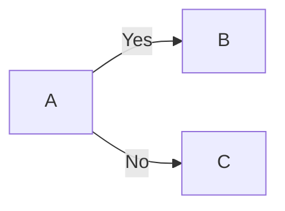

**Not**:
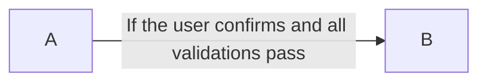

### 3.3 Layout Direction Guidelines

| Direction | Code | Best For |
|-----------|------|----------|
| Top-Down | `flowchart TD` | Decision trees, hierarchies |
| Left-Right | `flowchart LR` | Timelines, sequential processes |
| Bottom-Up | `flowchart BT` | Dependency trees |

**Default Recommendation**: Use `TD` (top-down) unless horizontal flow is more natural.

### 3.4 Subgraph Organization

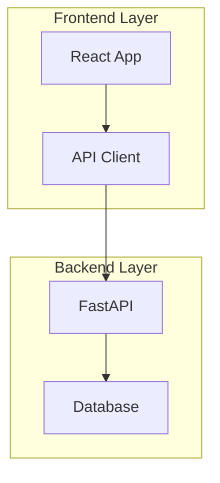

**Subgraph Limits**:
- 2-4 subgraphs per diagram
- 3-8 nodes per subgraph
- Clear, short subgraph titles

### 3.5 Styling with classDef

Use semantic styling to highlight node types:

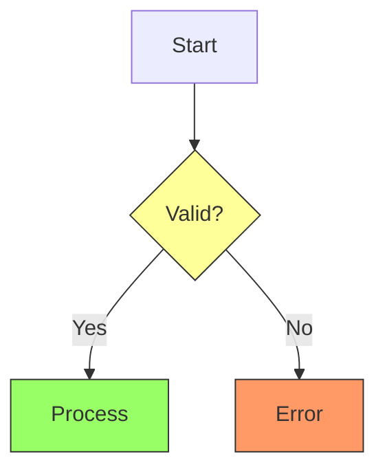

**Color Recommendations**:
- Decisions: Yellow/amber background
- Errors: Red/orange background
- Success: Green background
- Actions: Default or light blue

### 3.6 ELK Layout for Complex Diagrams

For larger diagrams, use the ELK renderer:


ELK provides better layout for:
- Diagrams with 30+ nodes
- Complex edge crossing patterns
- Hierarchical structures

---

## 4. Hierarchical Diagram Generation

### 4.1 Progressive Disclosure Pattern

Break complex systems into layers:

**Level 1: Overview** (5-7 nodes)
```
High-level components and their relationships
```

**Level 2: Component Detail** (one diagram per major component, 8-12 nodes each)
```
Internal structure of each component
```

**Level 3: Process Detail** (specific workflows, 6-10 nodes)
```
Step-by-step processes within components
```

### 4.2 Prompt Template for Hierarchical Generation

```
Create a 3-level diagram hierarchy for [system]:

Level 1 - System Overview:
- Maximum 5-7 nodes
- Show only major components
- No implementation details

Level 2 - Component Diagrams (one per major component):
- Maximum 10 nodes each
- Show internal structure
- Connect to other components at boundaries

Level 3 - Process Flows (one per critical process):
- Maximum 8 nodes
- Show step-by-step workflow
- Include decision points
```

### 4.3 When to Split Diagrams

Split when:
- Node count exceeds 15-20
- More than 3 decision branches exist
- Multiple distinct phases or domains are present
- Edge crossings make the diagram unreadable

---

## 5. Terminal-Friendly Alternatives

### 5.1 Graph-Easy (Recommended)

Converts text notation to ASCII art:

```bash
echo "[ Start ] --> [ Process ] --> [ End ]" | graph-easy
```

Output:
```
+-------+     +---------+     +-----+
| Start | --> | Process | --> | End |
+-------+     +---------+     +-----+
```

### 5.2 Compact Mermaid for Terminal Viewing

When Mermaid must be viewed as text, use compact formatting:

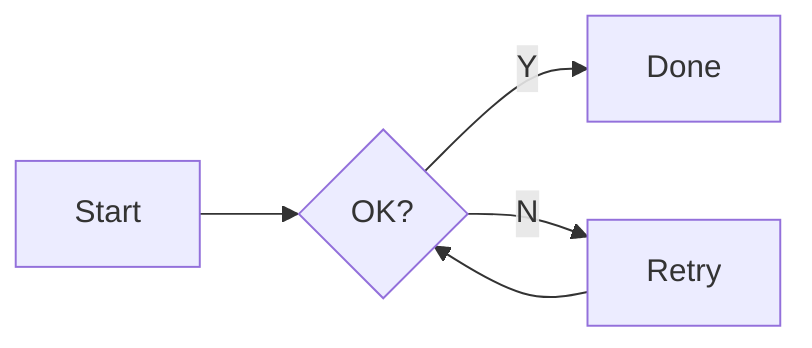

### 5.3 ASCII Summary + Mermaid Detail

For terminal contexts, provide both:

```
## Quick Reference (ASCII)
Start -> Validate -> [OK?] -Y-> Process -> End
                     -N-> Error -> End

## Full Diagram
[Mermaid code block]
```

### 5.4 Other ASCII Tools

| Tool | Best For | Platform |
|------|----------|----------|
| Graph-Easy | Quick flowcharts | Linux/Mac (Perl) |
| ASCIIFlow | Interactive editing | Web |
| Diagon | Sequence diagrams | CLI |
| Monodraw | Rich ASCII art | macOS |

---

## 6. Recommended Prompt Templates

### Template 1: Simple Flowchart Generation

```
You are a Mermaid diagram expert. Generate a clean, simple flowchart.

CONSTRAINTS:
- Maximum 10 nodes
- Maximum 2 decision points
- Use flowchart TD (top-down)
- Node labels: 2-4 words maximum
- Use short IDs (A, B, C) with descriptive labels

FORMAT:
- Return ONLY the Mermaid code block
- No explanations before or after
- Start with ```mermaid and end with ```

TOPIC: [Your topic here]
```

### Template 2: System Architecture (with Subgraphs)

```
Generate a Mermaid architecture diagram with these specifications:

STRUCTURE:
- 2-3 subgraphs representing major system layers
- 4-6 nodes per subgraph
- Clear connection labels between layers

STYLING:
- Use classDef for visual distinction:
  - frontend: blue theme
  - backend: green theme
  - database: orange theme

CONSTRAINTS:
- Total nodes: maximum 15
- Total connections: maximum 20
- Labels: maximum 3 words

OUTPUT: Only the Mermaid code, no explanations.

SYSTEM: [Describe your system]
```

### Template 3: Process Workflow with Decomposition

```
Create a 2-level diagram set for this process:

LEVEL 1 - OVERVIEW:
- Maximum 5-7 nodes
- Show main phases only
- Use flowchart LR

LEVEL 2 - DETAIL (one per phase):
- Maximum 8 nodes per phase
- Show steps within that phase
- Include decision points

FORMAT: Return as separate code blocks, clearly labeled.

PROCESS: [Your process here]
```

### Template 4: Error-Resistant Generation

```
Generate Mermaid flowchart syntax with these STRICT rules:

SYNTAX SAFETY:
- Never use "end" as a node ID (use "finish" or "done")
- Never start node IDs with "o" or "x"
- Use quotes for labels with special characters
- No parentheses in labels

STRUCTURE:
- Maximum 12 nodes
- flowchart TD direction
- Short IDs with bracket labels: A[Label]

VALIDATION:
- After generating, mentally verify:
  1. All brackets are balanced
  2. All arrows use --> not ->
  3. No reserved words as IDs

TOPIC: [Your topic]
```

### Template 5: Few-Shot with Example

```
Generate a Mermaid diagram following this example's structure and complexity:

EXAMPLE:
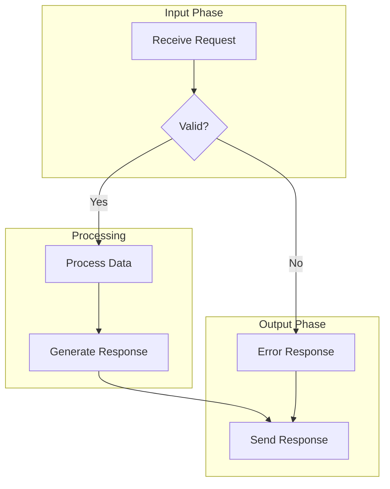

Create a similar diagram for: [Your topic]

REQUIREMENTS:
- Same structure: 2-3 subgraphs
- Same complexity: 6-8 nodes
- Same style: Short labels, clear decision point
```

---

## 7. Before/After Examples

### Example 1: Over-Complex vs. Focused

**BEFORE (Too Complex)**:
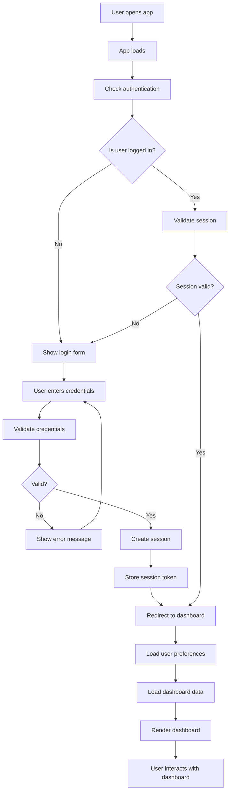
*19 nodes, multiple crossing paths, hard to follow*

**AFTER (Focused - Level 1 Overview)**:
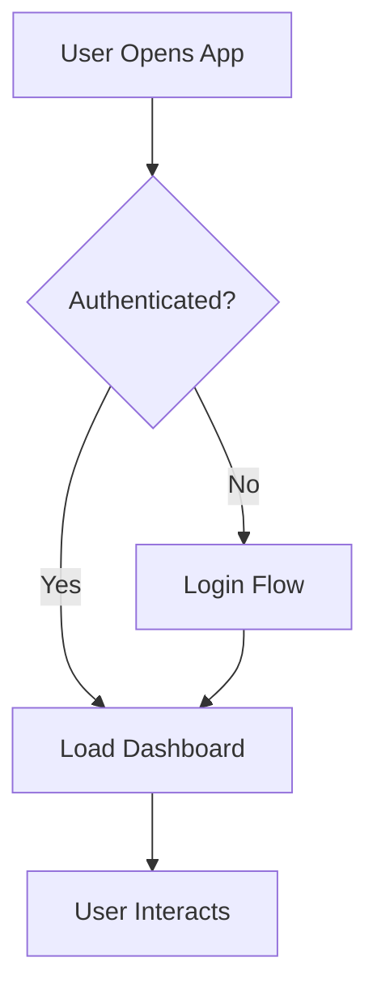
*5 nodes, clear flow, details in separate diagrams*

**AFTER (Focused - Level 2 Login Detail)**:
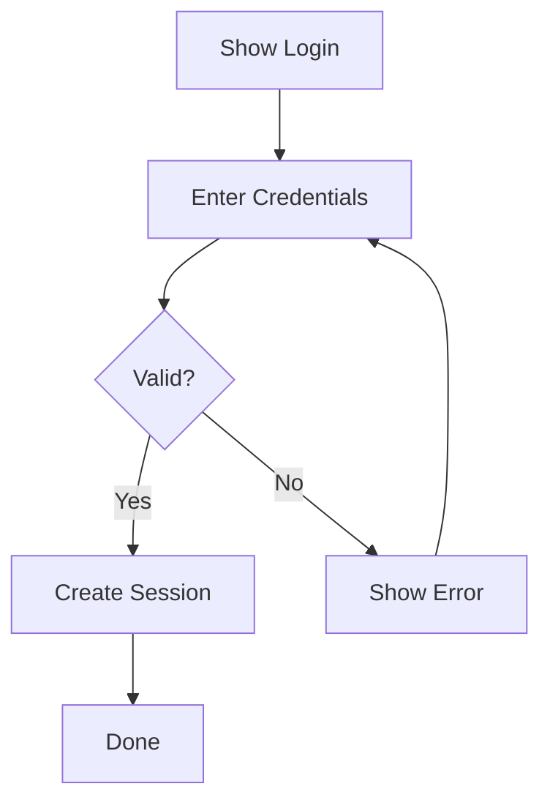
*6 nodes, single responsibility*

### Example 2: Poor Labels vs. Clear Labels

**BEFORE**:
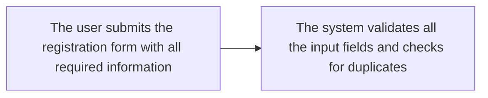

**AFTER**:
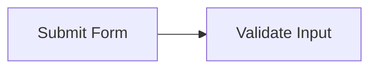

### Example 3: Missing Subgraphs vs. Organized

**BEFORE**:
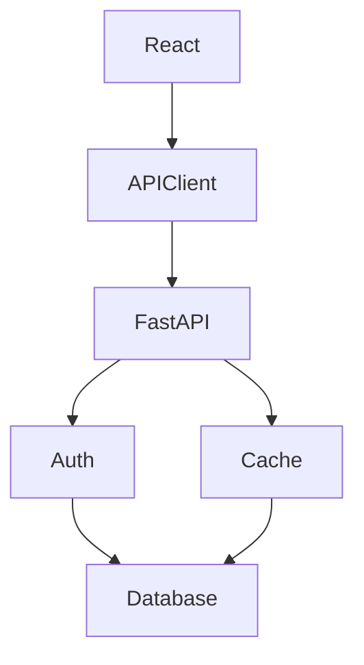

**AFTER**:
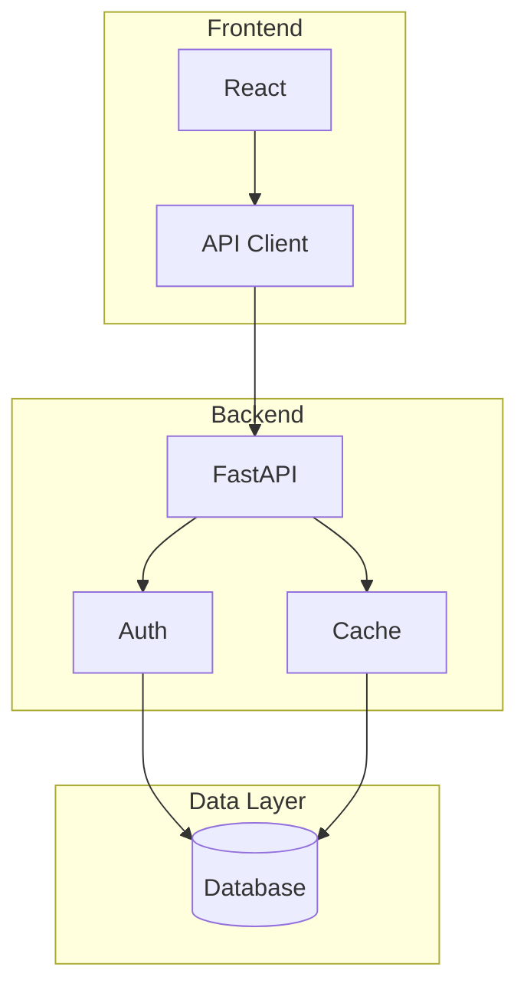

---

## 8. Common Errors and Fixes

### LLM-Generated Syntax Errors

| Error | Cause | Fix |
|-------|-------|-----|
| `Syntax error in text` | Reserved word as ID | Avoid `end`, capitalize if needed |
| Edge not rendering | Wrong arrow syntax | Use `-->` not `->` |
| Label disappears | Unescaped characters | Wrap in quotes: `["Label"]` |
| Subgraph breaks | Missing `end` keyword | Ensure every `subgraph` has `end` |

### Prompt to Fix Broken Diagrams

```
This Mermaid diagram has syntax errors:

[paste broken code]

ERROR MESSAGE: [paste error]

Fix the syntax while preserving the diagram's intent. Common issues:
- "end" as node ID (change to "finish")
- Missing arrow format (use -->)
- Unbalanced brackets
- Special characters in labels (wrap in quotes)

Return only the corrected Mermaid code.
```

### Validation Workflow

1. Generate diagram with constrained prompt
2. Test in [Mermaid Live Editor](https://mermaid.live)
3. If errors, use fix prompt with error message
4. If too complex, decompose and regenerate

---

## Sources

### Mermaid Documentation
- [Mermaid Flowchart Syntax](https://mermaid.js.org/syntax/flowchart.html)
- [Mermaid Theme Configuration](https://mermaid.js.org/config/theming.html)
- [Mermaid Layout Engines](https://mermaid.js.org/intro/syntax-reference.html)
- [Flow Charts are O(n)^2 Complex](https://mermaid.ai/docs/blog/posts/flow-charts-are-on2-complex-so-dont-go-over-100-connections)

### Prompt Engineering
- [Few-Shot Prompting Guide - PromptHub](https://www.prompthub.us/blog/the-few-shot-prompting-guide)
- [Chain-of-Thought Prompting - Prompting Guide](https://www.promptingguide.ai/techniques/cot)
- [Few-Shot Prompting - DataCamp](https://www.datacamp.com/tutorial/few-shot-prompting)
- [LLM + Mermaid - Mike Vincent](https://mike-vincent.medium.com/llm-mermaid-how-modern-teams-create-uml-diagrams-without-lucidchart-e54c56350804)

### Cognitive Science
- [Miller's Law - Laws of UX](https://lawsofux.com/millers-law/)
- [Scalability of Network Visualisation - PubMed](https://pubmed.ncbi.nlm.nih.gov/33301404/)
- [Chunking and Content Processing - NN/g](https://www.nngroup.com/articles/chunking/)

### Diagram Generation with AI
- [Generating Diagrams with AI/LLMs - smcleod.net](https://smcleod.net/2024/10/generating-diagrams-with-with-ai-/-llms/)
- [3 Easy Ways to Create Flowcharts with LLMs - KDnuggets](https://www.kdnuggets.com/3-easy-ways-create-flowcharts-diagrams-using-llms)
- [How to Create Software Diagrams with ChatGPT and Claude - The New Stack](https://thenewstack.io/how-to-create-software-diagrams-with-chatgpt-and-claude/)
- [Mermaid Diagram Generator Tutorial - h2oGPTe](https://docs.h2o.ai/enterprise-h2ogpte/tutorials/tutorial-10)

### Mermaid Subgraphs and Organization
- [Grouping Mermaid Nodes in Subgraphs - Waylon Walker](https://waylonwalker.com/mermaid-subgraphs/)
- [Mermaid Flowchart Tips and Tricks - kallemarjokorpi.fi](https://www.kallemarjokorpi.fi/blog/mastering-diagramming-as-code-essential-mermaid-flowchart-tips-and-tricks-2/)
- [Complete Flowchart Guide with Mermaid - Diagramly](https://docs.diagramly.ai/posts/2024/flowchart-guide-mermaid/)

### Terminal/ASCII Alternatives
- [How to Draw ASCII Diagrams in Shell - Baeldung](https://www.baeldung.com/linux/shell-ascii-diagrams)
- [Graph-Easy - Linux Man Page](https://linux.die.net/man/1/graph-easy)
- [ASCIIFlow](https://asciiflow.com/)
- [Diagon - GitHub](https://github.com/ArthurSonzogni/Diagon)

### Error Handling
- [Mermaid Fixer - GitHub](https://github.com/sopaco/mermaid-fixer)
- [Mermaid Validator MCP Server](https://mcpmarket.com/server/mermaid-validator-1)
- [GenAIScript Mermaid Error Handling](https://microsoft.github.io/genaiscript/blog/mermaids/)

---

## 9. AI/LLM Mermaid Generation: GitHub Tools & Academic Research

### 9.1 Academic Research: MermaidSeqBench (arXiv 2024)

The first academic benchmark for evaluating LLM-to-Mermaid diagram generation introduces **six fine-grained evaluation dimensions**:

| Dimension | What It Measures | Score Range |
|-----------|------------------|-------------|
| **Syntax** | Valid Mermaid syntax that renders | 0-1 |
| **Mermaid-Specific** | Proper use of Mermaid conventions | 0-1 |
| **Logic & Flow** | Accurate interaction sequence | 0-1 |
| **Completeness** | All components included | 0-1 |
| **Activation Handling** | Correct activate/deactivate | 0-1 |
| **Error & Status** | Proper error case handling | 0-1 |

**Key Finding**: Larger models (7B-8B parameters) substantially outperform smaller versions. Qwen 2.5-7B and Llama 3.1-8B achieved highest scores.

**Best Practice from Research**: Pair each diagram with "a structured natural language description capturing its Purpose, Main Components, and Interactions."

*Source: [MermaidSeqBench - arXiv](https://arxiv.org/html/2511.14967v1)*

### 9.2 GitHub Tool: Swark (VS Code Extension)

**Architecture Diagram Generator from Code**

Swark uses a four-step process:
1. **File Retrieval**: Gathers source files, adjusting count for token limits
2. **Prompt Construction**: Embeds code with diagram generation instructions
3. **LLM Invocation**: Sends to GitHub Copilot via VS Code API
4. **Preview**: Displays Mermaid in markdown preview

**Key Configuration Options**:
- `swark.maxFiles` - Limit files in analysis
- `swark.fileExtensions` - Filter file types
- `swark.fixMermaidCycles` - Auto-fix circular references

**Takeaway**: Token-aware context management is essential for code-to-diagram generation.

*Source: [swark-io/swark - GitHub](https://github.com/swark-io/swark)*

### 9.3 GitHub Tool: LLMermaid

**Using Mermaid to Control LLM Behavior**

LLMermaid flips the paradigm - instead of LLMs generating diagrams, it uses Mermaid flowcharts to *control* LLM execution flow:

```
By defining Mermaid execution prompts within custom instructions,
LLMermaid allows LLMs to act according to the specified flowcharts.
```

**Application**: Define complex multi-step processes as Mermaid, then have the LLM follow the diagram as a state machine.

*Source: [fladdict/llmermaid - GitHub](https://github.com/fladdict/llmermaid)*

### 9.4 Microsoft GenAIScript: Mermaid Repairer Pattern

**Handling LLM Syntax Errors via Iterative Repair**

The GenAIScript team developed an automated repair loop:

1. **Generate**: LLM creates initial diagram
2. **Validate**: Parse for syntax errors
3. **Repair**: Send error message back to LLM
4. **Iterate**: LLM fixes based on error context

```javascript
// Pseudo-code for repairer pattern
if (mermaidParseError) {
  addMessageToChat(`Fix this syntax error: ${error.message}`);
  // LLM receives full conversation + error
  // and corrects the diagram
}
```

**Key Insight**: "Most LLMs perform well at fixing mermaid syntax when given explicit error feedback."

*Source: [GenAIScript Mermaid Blog - Microsoft](https://microsoft.github.io/genaiscript/blog/mermaids/)*

### 9.5 Additional GitHub Resources

| Repository | Purpose | Stars |
|------------|---------|-------|
| [mermaid-js/mermaid](https://github.com/mermaid-js/mermaid) | Core library | 70k+ |
| [veelenga/claude-mermaid](https://github.com/veelenga/claude-mermaid) | Claude MCP Server | - |
| [peng-shawn/mermaid-mcp-server](https://github.com/peng-shawn/mermaid-mcp-server) | PNG/SVG conversion | - |
| [farleyknight/claude-mermaid-diagrams](https://github.com/farleyknight/claude-mermaid-diagrams) | Java→Mermaid via Claude | - |
| [sopaco/mermaid-fixer](https://github.com/sopaco/mermaid-fixer) | Syntax error repair | - |
| [ArthurSonzogni/Diagon](https://github.com/ArthurSonzogni/Diagon) | ASCII diagram generator | - |

### 9.6 Best Practices from Industry Sources

**From KDnuggets (2025)**:
- Be specific - more detail = more accurate results
- Iterate - tweak generated code based on feedback
- Combine tools - Mermaid for drafts, Graphviz for complex diagrams

**From AddJam (2025)**:
- Break large systems into smaller, focused components
- LLMs work better with specific, bounded contexts
- "If your diagram is growing too big, quality decreases quickly"
- Always review and verify generated output

**From Mermaid Chart (2025)**:
- AI diagram repair can fix syntax errors automatically
- Match tool to diagram type (flowchart, ERD, UML, etc.)

---

## Appendix: Quick Reference Card

```
PROMPT CHECKLIST:
[ ] Specify diagram type (flowchart TD/LR)
[ ] Set node limit (10-15 typical)
[ ] Request short labels (2-4 words)
[ ] Include 1-2 few-shot examples
[ ] Ask for subgraphs if >10 nodes
[ ] Request "only Mermaid code, no explanations"

MERMAID SYNTAX QUICK TIPS:
- Direction: flowchart TD (top-down) or LR (left-right)
- Nodes: A[Label] or A{Decision}
- Edges: --> (arrow), -->|text| (labeled)
- Subgraphs: subgraph id[Title] ... end
- Styling: classDef name fill:#color; class node name

COMPLEXITY LIMITS:
- Working memory: 5-9 chunks
- Simple flowchart: 10-15 nodes max
- With subgraphs: 40-60 nodes total
- Connections: under 100 total
- Decision points: 2-3 max per diagram

DECOMPOSITION TRIGGERS:
- >20 nodes in single view
- >3 decision branches
- Multiple distinct domains
- Excessive edge crossings
```
